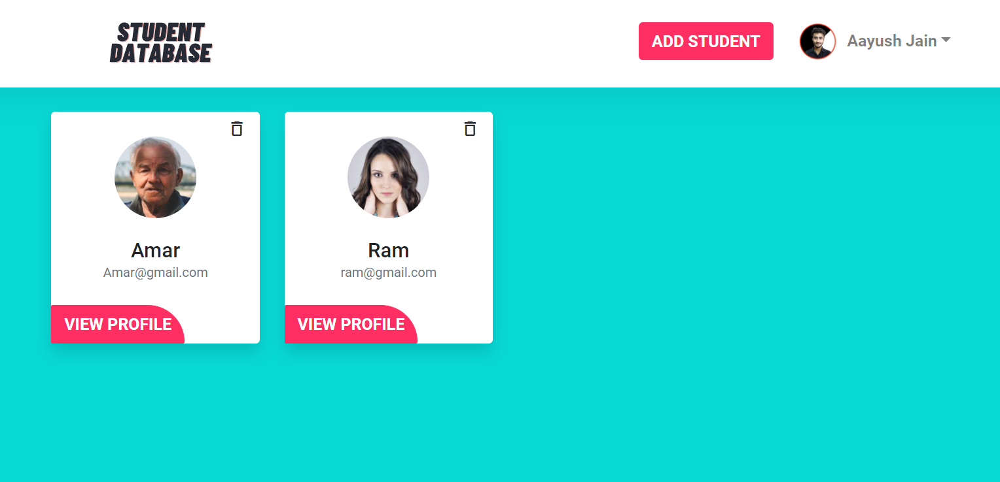
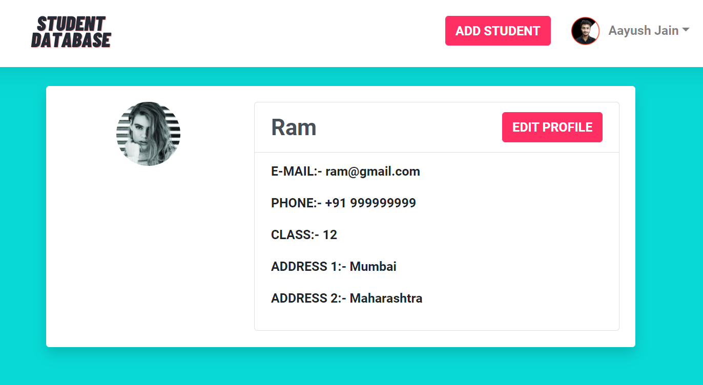
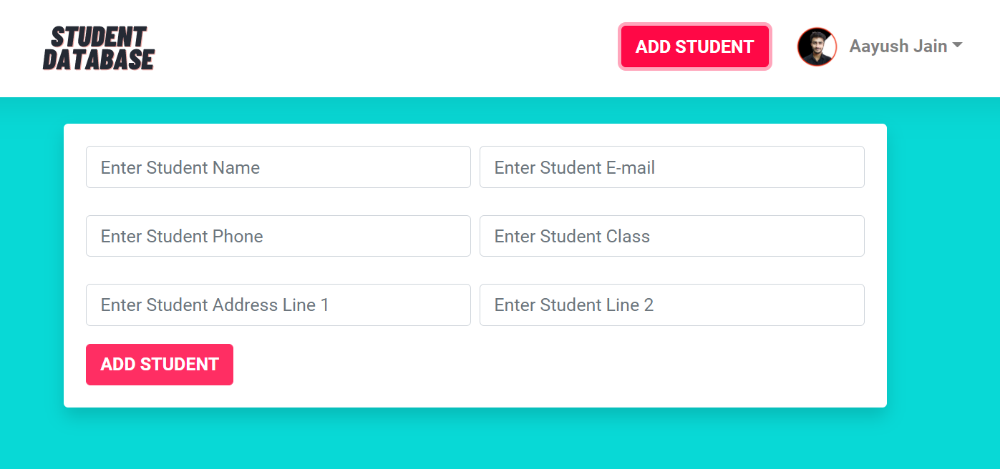
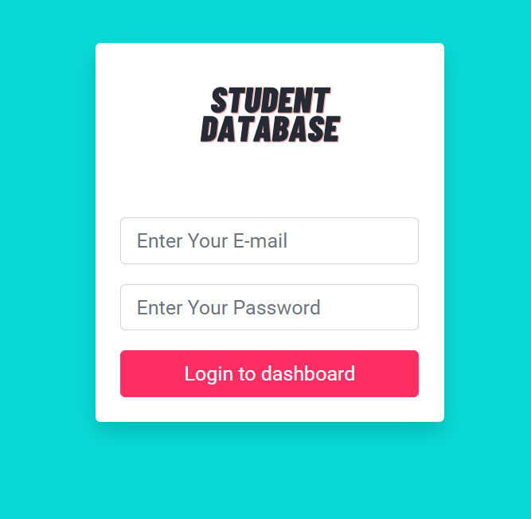

# 

> ### React + Redux codebase containing real world examples (CRUD, auth, api, etc) .

### [Demo](https://student-database-15cbe.web.app/)&nbsp;&nbsp;&nbsp;&nbsp;

## Getting started

You can view a live demo over at https://student-database-15cbe.web.app/
### ID:- "demo@gmail.com"
### pwd:-123456

To get the frontend running locally:

- Clone this repo
- `npm install` to install all req'd dependencies
- `npm start` to start the local server (this project uses create-react-app)

**General functionality:**

- Authenticate users via firebase.
- CRUD Opeations
- login/logout
- random profile images
- GET and display data
In the project directory, you can run:

